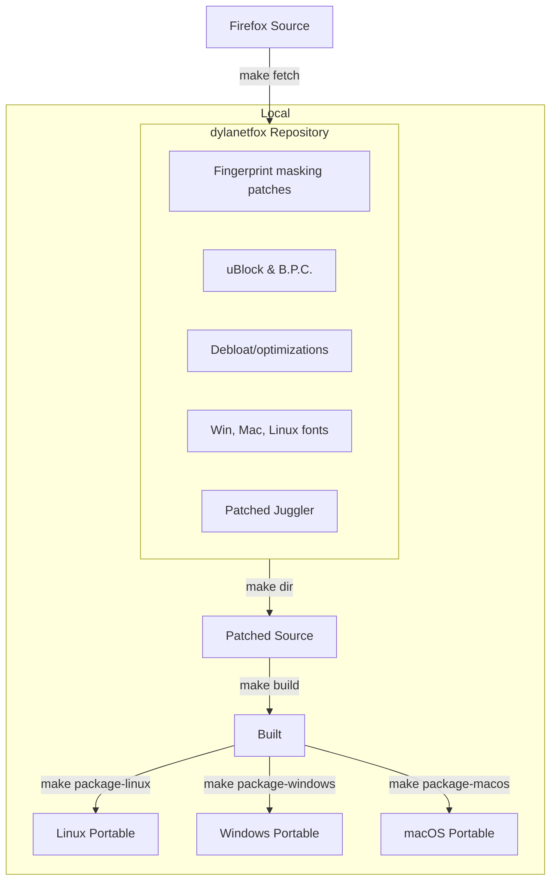
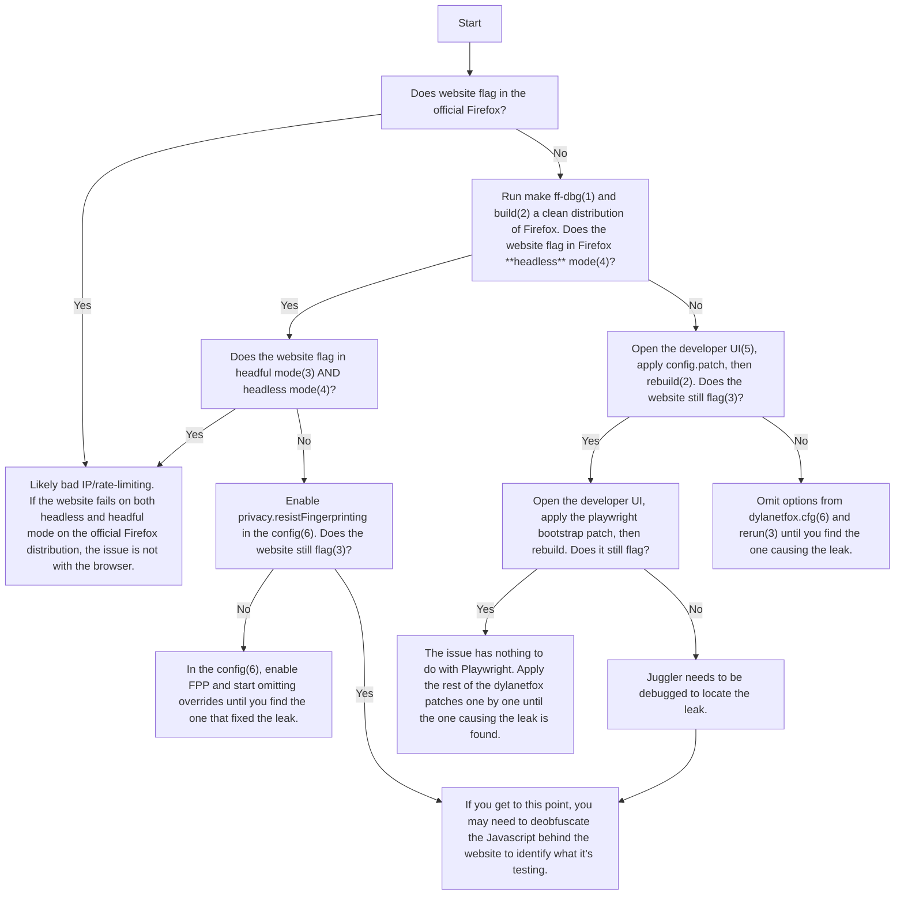

Navigator properties can be fully spoofed to other Firefox fingerprints, and it is **completely safe**! However, there are some issues when spoofing Chrome (leaks noted).

| Property                       | Notes |
| ------------------------------ | ----- |
| navigator.userAgent            | ✅    |
| navigator.doNotTrack           | ✅    |
| navigator.appCodeName          | ✅    |
| navigator.appName              | ✅    |
| navigator.appVersion           | ✅    |
| navigator.oscpu                | ✅    |
| navigator.language             | ✅    |
| navigator.languages            | ✅    |
| navigator.platform             | ✅    |
| navigator.hardwareConcurrency  | ✅    |
| navigator.product              | ✅    |
| navigator.productSub           | ✅    |
| navigator.maxTouchPoints       | ✅    |
| navigator.cookieEnabled        | ✅    |
| navigator.globalPrivacyControl | ✅    |
| navigator.appVersion           | ✅    |
| navigator.buildID              | ✅    |
| navigator.doNotTrack           | ✅    |

dylanetfox will automatically add the following default fonts associated your spoofed User-Agent OS (the value passed in `navigator.userAgent`).

**Notes**:

- **navigator.webdriver** is set to false at all times.
- `navigator.language` & `navigator.languages` will fall back to the `locale:language`/`locale:region` values if not set.
- When spoofing Chrome fingerprints, the following may leak:
  - navigator.userAgentData missing.
  - navigator.deviceMemory missing.
- Changing the presented Firefox version can be detected by some testing websites, but typically will not flag production WAFs.

</details>

<details>
<summary>
Cursor movement
</summary>


### Properties

| Property         | Supported | Description                                                         |
| ---------------- | --------- | ------------------------------------------------------------------- |
| humanize         | ✅        | Enable/disable human-like cursor movement. Defaults to False.       |
| humanize:maxTime | ✅        | Maximum time in seconds for the cursor movement. Defaults to `1.5`. |
| showcursor       | ✅        | Toggles the cursor highlighter. Defaults to True.                   |

**Notes:**

- The cursor highlighter is **not** ran in the page context. It will not be visible to the page. You don't have to worry about it leaking.

</details>

<details>
<summary>
Fonts
</summary>

<details>
<summary>
Screen
</summary>

| Property           | Status |
| ------------------ | ------ |
| screen.availHeight | ✅     |
| screen.availWidth  | ✅     |
| screen.availTop    | ✅     |
| screen.availLeft   | ✅     |
| screen.height      | ✅     |
| screen.width       | ✅     |
| screen.colorDepth  | ✅     |
| screen.pixelDepth  | ✅     |
| screen.pageXOffset | ✅     |
| screen.pageYOffset | ✅     |

**Notes:**

- `screen.colorDepth` and `screen.pixelDepth` are synonymous.

</details>

<details>
<summary>
Window
</summary>

| Property                | Status | Notes                           |
| ----------------------- | ------ | ------------------------------- |
| window.scrollMinX       | ✅     |
| window.scrollMinY       | ✅     |
| window.scrollMaxX       | ✅     |
| window.scrollMaxY       | ✅     |
| window.outerHeight      | ✅     | Sets the window height.         |
| window.outerWidth       | ✅     | Sets the window width.          |
| window.innerHeight      | ✅     | Sets the inner viewport height. |
| window.innerWidth       | ✅     | Sets the inner viewport width.  |
| window.screenX          | ✅     |
| window.screenY          | ✅     |
| window.history.length   | ✅     |
| window.devicePixelRatio | ✅     | Works, but not recommended.     |

**Notes:**

- Setting the outer window viewport will cause some cosmetic defects to the dylanetfox window if the user attempts to manually resize it. Under no circumstances will dylanetfox allow the outer window viewport to be resized.

</details>

<details>
<summary>
Document
</summary>

Spoofing document.body has been implemented, but it is more advicable to set `window.innerWidth` and `window.innerHeight` instead.

| Property                   | Status |
| -------------------------- | ------ |
| document.body.clientWidth  | ✅     |
| document.body.clientHeight | ✅     |
| document.body.clientTop    | ✅     |
| document.body.clientLeft   | ✅     |

</details>

<details>
<summary>
HTTP Headers
</summary>

dylanetfox can override the following network headers:

| Property                | Status |
| ----------------------- | ------ |
| headers.User-Agent      | ✅     |
| headers.Accept-Language | ✅     |
| headers.Accept-Encoding | ✅     |

**Notes:**

- If `headers.User-Agent` is not set, it will fall back to `navigator.userAgent`.

</details>

<details>
<summary>
Geolocation & Intl
</summary>

| Property              | Status | Description                                                                                                                                            | Required Keys           |
| --------------------- | ------ | ------------------------------------------------------------------------------------------------------------------------------------------------------ | ----------------------- |
| geolocation:latitude  | ✅     | Latitude to use.                                                                                                                                       | `geolocation:longitude` |
| geolocation:longitude | ✅     | Longitude to use.                                                                                                                                      | `geolocation:latitude`  |
| geolocation:accuracy  | ✅     | Accuracy in meters. This will be calculated automatically using the decminal percision of `geolocation:latitude` & `geolocation:longitude` if not set. |                         |
| timezone              | ✅     | Set a custom TZ timezone (e.g. "America/Chicago"). This will also change `Date()` to return the local time.                                            |                         |
| locale:language       | ✅     | Spoof the Intl API, headers, and system language (e.g. "en")                                                                                           | `locale:region`         |
| locale:region         | ✅     | Spoof the Intl API, headers, and system region (e.g. "US").                                                                                            | `locale:language`       |
| locale:script         | ✅     | Set a custom script (e.g. "Latn"). Will be set automatically if not specified.                                                                         |                         |

The **Required Keys** are keys that must also be set for the property to work.

**Notes:**

- Location permission prompts will be accepted automatically if `geolocation:latitude` and `geolocation:longitude` are set.
- `timezone` **must** be set to a valid TZ identifier. See [here](https://en.wikipedia.org/wiki/List_of_tz_database_time_zones) for a list of valid timezones.
- `locale:language` & `locale:region` **must** be set to valid locale values. See [here](https://simplelocalize.io/data/locales/) for a list of valid locale-region values.

</details>

<details>
<summary>
WebRTC IP
</summary>

dylanetfox implements WebRTC IP spoofing at the protocol level by modifying ICE candidates and SDP before they're sent.

| Property    | Status | Description         |
| ----------- | ------ | ------------------- |
| webrtc:ipv4 | ✅     | IPv4 address to use |
| webrtc:ipv6 | ✅     | IPv6 address to use |

**Notes:**

- To completely disable WebRTC, set the `media.peerconnection.enabled` preference to `false`.

</details>

<details>
<summary>
WebGL
</summary>

### WebGL in dylanetfox

WebGL is disabled in dylanetfox by default. To enable it, set the `webgl.disabled` Firefox preference to `false`.

WebGL being disabled typically doesn't trigger detection by WAFs, so you generally don't need to be concerned about it. Only use WebGL when it's absolutely necessary for your specific use case.

Because I don't have a dataset of WebGL fingerprints to rotate against, WebGL fingerprint rotation is not implemented in the dylanetfox Python library. If you need to spoof WebGL, you can do so manually with the following properties.

### Properties

dylanetfox supports spoofing WebGL parameters, supported extensions, context attributes, and shader precision formats.

**Note**: Do NOT randomly assign values to these properties. WAFs hash your WebGL fingerprint and compare it against a dataset. Randomly assigning values will lead to detection as an unknown device.

| Property                                        | Description                                                                                                           | Example                                                                                 |
| ----------------------------------------------- | --------------------------------------------------------------------------------------------------------------------- | --------------------------------------------------------------------------------------- |
| webGl:renderer                                  | Spoofs the name of the unmasked WebGL renderer.                                                                       | `"NVIDIA GeForce GTX 980, or similar"`                                                  |
| webGl:vendor                                    | Spoofs the name of the unmasked WebGL vendor.                                                                         | `"NVIDIA Corporation"`                                                                  |
| webGl:supportedExtensions                       | An array of supported WebGL extensions ([full list](https://registry.khronos.org/webgl/extensions/)).                 | `["ANGLE_instanced_arrays", "EXT_color_buffer_float", "EXT_disjoint_timer_query", ...]` |
| webGl2:supportedExtensions                      | The same as `webGl:supportedExtensions`, but for WebGL2.                                                              | `["ANGLE_instanced_arrays", "EXT_color_buffer_float", "EXT_disjoint_timer_query", ...]` |
| webGl:contextAttributes                         | A dictionary of WebGL context attributes.                                                                             | `{"alpha": true, "antialias": true, "depth": true, ...}`                                |
| webGl2:contextAttributes                        | The same as `webGl:contextAttributes`, but for WebGL2.                                                                | `{"alpha": true, "antialias": true, "depth": true, ...}`                                |
| webGl:parameters                                | A dictionary of WebGL parameters. Keys must be GL enums, and values are the values to spoof them as.                  | `{"2849": 1, "2884": false, "2928": [0, 1], ...}`                                       |
| webGl2:parameters                               | The same as `webGl:parameters`, but for WebGL2.                                                                       | `{"2849": 1, "2884": false, "2928": [0, 1], ...}`                                       |
| webGl:parameters:blockIfNotDefined              | If set to `true`, only the parameters in `webGl:parameters` will be allowed. Can be dangerous if not used correctly.  | `true`/`false`                                                                          |
| webGl2:parameters:blockIfNotDefined             | If set to `true`, only the parameters in `webGl2:parameters` will be allowed. Can be dangerous if not used correctly. | `true`/`false`                                                                          |
| webGl:shaderPrecisionFormats                    | A dictionary of WebGL shader precision formats. Keys are formatted as `"<shaderType>,<precisionType>"`.               | `{"35633,36336": {"rangeMin": 127, "rangeMax": 127, "precision": 23}, ...}`             |
| webGl2:shaderPrecisionFormats                   | The same as `webGL:shaderPrecisionFormats`, but for WebGL2.                                                           | `{"35633,36336": {"rangeMin": 127, "rangeMax": 127, "precision": 23}, ...}`             |
| webGl:shaderPrecisionFormats:blockIfNotDefined  | If set to `true`, only the shader percisions in `webGl:shaderPrecisionFormats` will be allowed.                       | `true`/`false`                                                                          |
| webGl2:shaderPrecisionFormats:blockIfNotDefined | If set to `true`, only the shader percisions in `webGl2:shaderPrecisionFormats` will be allowed.                      | `true`/`false`                                                                          |

</details>

<details>
<summary>
AudioContext
</summary>

dylanetfox can spoof the AudioContext sample rate, output latency, and max channel count.

| Property                     | Status | Description                                |
| ---------------------------- | ------ | ------------------------------------------ |
| AudioContext:sampleRate      | ✅     | Spoofs the AudioContext sample rate.       |
| AudioContext:outputLatency   | ✅     | Spoofs the AudioContext output latency.    |
| AudioContext:maxChannelCount | ✅     | Spoofs the AudioContext max channel count. |


</details>

<details>
<summary>
Addons
</summary>

In the dylanetfox Python library, addons can be loaded with the `addons` parameter:

```python
from dylanetfox.sync_api import dylanetfox

with dylanetfox(addons=['/path/to/addon', '/path/to/addon2']) as browser:
    page = browser.new_page()
```

dylanetfox will automatically download and use the latest uBlock Origin with custom privacy/adblock filters, and B.P.C. by default to help with ad circumvention.

You can also exclude default addons with the `exclude_addons` parameter:

```python
from dylanetfox.sync_api import dylanetfox
from dylanetfox import DefaultAddons

with dylanetfox(exclude_addons=[DefaultAddons.UBO, DefaultAddons.BPC]) as browser:
    page = browser.new_page()
```

<details>
<summary>
Loading addons with the legacy launcher...
</summary>

Addons can be loaded with the `--addons` flag.

Example:

```bash
./launcher --addons '["/path/to/addon", "/path/to/addon2"]'
```

dylanetfox will automatically download and use the latest uBlock Origin with custom privacy/adblock filters, and B.P.C. by default to help with scraping.

You can also exclude default addons with the `--exclude-addons` flag:

```bash
./launcher --exclude-addons '["uBO", "BPC"]'
```

</details>

---

</details>

<details>
<summary>
Miscellaneous (battery status, etc)
</summary>

| Property                | Status | Description                                                                                                                     |
| ----------------------- | ------ | ------------------------------------------------------------------------------------------------------------------------------- |
| pdfViewer               | ✅     | Sets navigator.pdfViewerEnabled. Please keep this on though, many websites will flag a lack of pdfViewer as a headless browser. |
| battery:charging        | ✅     | Spoofs the battery charging status.                                                                                             |
| battery:chargingTime    | ✅     | Spoofs the battery charging time.                                                                                               |
| battery:dischargingTime | ✅     | Spoofs the battery discharging time.                                                                                            |
| battery:level           | ✅     | Spoofs the battery level.                                                                                                       |

</details>

</details>

<hr width=50>

## Patches

### What changes were made?

#### Fingerprint spoofing

- Navigator properties spoofing (device, browser, locale, etc.)
- Support for emulating screen size, resolution, etc.
- Spoof WebGL parameters, supported extensions, context attributes, and shader precision formats.
- Spoof inner and outer window viewport sizes
- Spoof AudioContext sample rate, output latency, and max channel count
- Spoof device voices & playback rates
- Network headers (Accept-Languages and User-Agent) are spoofed to match the navigator properties
- WebRTC IP spoofing at the protocol level
- Geolocation, timezone, and locale spoofing
- Battery API spoofing
- etc.

#### Stealth patches

- Avoids main world execution leaks. All page agent javascript is sandboxed
- Avoids frame execution context leaks
- Fixes `navigator.webdriver` detection
- Fixes Firefox headless detection via pointer type ([#26](https://github.com/dylanyunlon/dylanetfox/issues/26))
- Removed potentially leaking anti-zoom/meta viewport handling patches
- Uses non-default screen & window sizes
- Re-enable fission content isolations
- Re-enable PDF.js
- Other leaking config properties changed

#### Anti font fingerprinting

- Automatically uses the correct system fonts for your User Agent
- Bundled with Windows, Mac, and Linux system fonts
- Prevents font metrics fingerprinting by randomly offsetting letter spacing

#### Playwright support

- Custom implementation of Playwright for the latest Firefox
- Various config patches to evade bot detection

#### Debloat/Optimizations

- Stripped out/disabled _many, many_ Mozilla services. Runs faster than the original Mozilla Firefox, and uses less memory (200mb)
- Patches from LibreWolf & Ghostery to help remove telemetry & bloat
- Debloat config from PeskyFox, LibreWolf, and others
- Speed & network optimizations from FastFox
- Removed all CSS animations
- Minimalistic theming
- etc.

#### Addons

- Firefox addons can be loaded with the `--addons` flag
- Added uBlock Origin with custom privacy filters
- Addons are not allowed to open tabs
- Addons are automatically enabled in Private Browsing mode
- Addons are automatically pinned to the toolbar
- Fixes DNS leaks with uBO prefetching

## Stealth Performance

In dylanetfox, all of Playwright's internal Page Agent Javascript is sandboxed and isolated.
This makes it **impossible** for a page to detect the presence of Playwright through Javascript inspection.

<details>
<summary>
See legacy launcher usage (deprecated)
</summary>

dylanetfox is fully compatible with your existing Playwright code. You only have to change your browser initialization:

```py
browser = pw.firefox.launch(
  executable_path='/path/to/dylanetfox/launch',  # Path to the dylanetfox launcher
  args=['--config', '/path/to/config.json'],   # File path or JSON string
)
```

<details>
<summary>
See full example script...
</summary>

```py
import asyncio
import json
from playwright.async_api import async_playwright

# Example config
CONFIG = {
 'window.outerHeight': 1056,
 'window.outerWidth': 1920,
 'window.innerHeight': 1008,
 'window.innerWidth': 1920,
 'window.history.length': 4,
 'navigator.userAgent': 'Mozilla/5.0 (Windows NT 10.0; Win64; x64; rv:125.0) Gecko/20100101 Firefox/125.0',
 'navigator.appCodeName': 'Mozilla',
 'navigator.appName': 'Netscape',
 'navigator.appVersion': '5.0 (Windows)',
 'navigator.oscpu': 'Windows NT 10.0; Win64; x64',
 'navigator.language': 'en-US',
 'navigator.languages': ['en-US'],
 'navigator.platform': 'Win32',
 'navigator.hardwareConcurrency': 12,
 'navigator.product': 'Gecko',
 'navigator.productSub': '20030107',
 'navigator.maxTouchPoints': 10,
}

async def main():
    async with async_playwright() as p:
        # Create a Firefox instance to the launcher
        browser = await p.firefox.launch(
          # Pass in the dylanetfox launcher and config JSON
          executable_path='/path/to/dylanetfox/launch',
          args=['--config', json.dumps(CONFIG)],
          # Launch in headful mode
          headless=False
        )
        # Continue as normal
        page = await browser.new_page()
        await page.goto('https://abrahamjuliot.github.io/creepjs/')
        await asyncio.sleep(10)
        await browser.close()

if __name__ == "__main__":
    asyncio.run(main())
```

</details>
</details>

---

<h1 align="center">Build System</h1>

### Overview

Here is a diagram of the build system, and its associated make commands:



This was originally based on the LibreWolf build system.

## Build CLI

> [!WARNING]
> dylanetfox's build system is designed to be used in Linux. WSL will not work!

First, clone this repository with Git:

```bash
git clone --depth 1 https://github.com/dylanyunlon/dylanetfox
cd dylanetfox
```

Next, build the dylanetfox source code with the following command:

```bash
make dir
```

After that, you have to bootstrap your system to be able to build dylanetfox. You only have to do this one time. It is done by running the following command:

```bash
make bootstrap
```

Finally you can build and package dylanetfox the following command:

```bash
python3 multibuild.py --target linux windows macos --arch x86_64 arm64 i686
```

<details>
<summary>
CLI Parameters
</summary>

```bash
Options:
  -h, --help            show this help message and exit
  --target {linux,windows,macos} [{linux,windows,macos} ...]
                        Target platforms to build
  --arch {x86_64,arm64,i686} [{x86_64,arm64,i686} ...]
                        Target architectures to build for each platform
  --bootstrap           Bootstrap the build system
  --clean               Clean the build directory before starting

Example:
$ python3 multibuild.py --target linux windows macos --arch x86_64 arm64
```

</details>

### Using Docker

dylanetfox can be built through Docker on all platforms.

1. Create the Docker image containing Firefox's source code:

```bash
docker build -t dylanetfox-builder .
```

2. Build dylanetfox patches to a target platform and architecture:

```bash
docker run -v "$(pwd)/dist:/app/dist" dylanetfox-builder --target <os> --arch <arch>
```

<details>
<summary>
How can I use my local ~/.mozbuild directory?
</summary>

If you want to use the host's .mozbuild directory, you can use the following command instead to run the docker:

```bash
docker run \
  -v "$HOME/.mozbuild":/root/.mozbuild:rw,z \
  -v "$(pwd)/dist:/app/dist" \
  dylanetfox-builder \
  --target <os> \
  --arch <arch>
```

</details>

<details>
<summary>
Docker CLI Parameters
</summary>

```bash
Options:
  -h, --help            show this help message and exit
  --target {linux,windows,macos} [{linux,windows,macos} ...]
                        Target platforms to build
  --arch {x86_64,arm64,i686} [{x86_64,arm64,i686} ...]
                        Target architectures to build for each platform
  --bootstrap           Bootstrap the build system
  --clean               Clean the build directory before starting

Example:
$ docker run -v "$(pwd)/dist:/app/dist" dylanetfox-builder --target windows macos linux --arch x86_64 arm64 i686
```

</details>

Build artifacts will now appear written under the `dist/` folder.

---

## Development Tools

This repo comes with a developer UI under scripts/developer.py:

```
make edits
```

Patches can be edited, created, removed, and managed through here.


### How to make a patch

1. In the developer UI, click **Reset workspace**.
2. Make changes in the `dylanetfox-*/` folder as needed. You can test your changes with `make build` and `make run`.
3. After you're done making changes, click **Write workspace to patch** and save the patch file.

### How to work on an existing patch

1. In the developer UI, click **Edit a patch**.
2. Select the patch you'd like to edit. Your workspace will be reset to the state of the selected patch.
3. After you're done making changes, hit **Write workspace to patch** and overwrite the existing patch file.

---

## Leak Debugging

This is a flow chart demonstrating my process for determining leaks without deobfuscating WAF Javascript. The method incrementally reintroduces dylanetfox's features into Firefox's source code until the testing site flags.

This process requires a Linux system and assumes you have Firefox build tools installed (see [here](https://github.com/dylanyunlon/dylanetfox?tab=readme-ov-file#build-cli)).

<details>
<summary>
See flow chart...
</summary>



#### Cited Commands

| #   | Command                                       | Description                                                                                                 |
| --- | --------------------------------------------- | ----------------------------------------------------------------------------------------------------------- |
| (1) | `make ff-dbg`                                 | Setup vanilla Firefox with minimal patches.                                                                 |
| (2) | `make build`                                  | Build the source code.                                                                                      |
| (3) | `make run`                                    | Runs the built browser.                                                                                     |
| (4) | `make run args="--headless https://test.com"` | Run a URL in headless mode. All redirects will be printed to the console to determine if the test passed.   |
| (5) | `make edits`                                  | Opens the developer UI. Allows the user to apply/undo patches, and see which patches are currently applied. |
| (6) | `make edit-cfg`                               | Edit dylanetfox.cfg in the default system editor.                                                             |

</details>

---

## Thanks

- [LibreWolf](https://gitlab.com/librewolf-community/browser/source) - Debloat patches & build system inspiration
- [Camoufox](https://github.com/dairfi/camoufox) - Debloat & optimizations
- [Ghostery](https://github.com/ghostery/user-agent-desktop) - Debloat reference
- [TOR Browser](https://2019.www.torproject.org/projects/torbrowser/design/) - Anti fingerprinting reference
- [Jamir-boop/minimalisticfox](https://github.com/Jamir-boop/minimalisticfox) - Inspired dylanetfox's minimalistic theming
- [nicoth-in/Dark-Space-Theme](https://github.com/nicoth-in/Dark-Space-Theme) - dylanetfox's dark theme
- [Playwright](https://github.com/microsoft/playwright/tree/main/browser_patches/firefox), [Puppeteer/Juggler](https://github.com/puppeteer/juggler) - Original Juggler implementation
- [CreepJS](https://github.com/abrahamjuliot/creepjs), [Browserleaks](https://browserleaks.com), [BrowserScan](https://www.browserscan.net/) - Valuable leak testing sites
- [riflosnake/HumanCursor](https://github.com/riflosnake/HumanCursor) - Original human-like cursor movement algorithm
